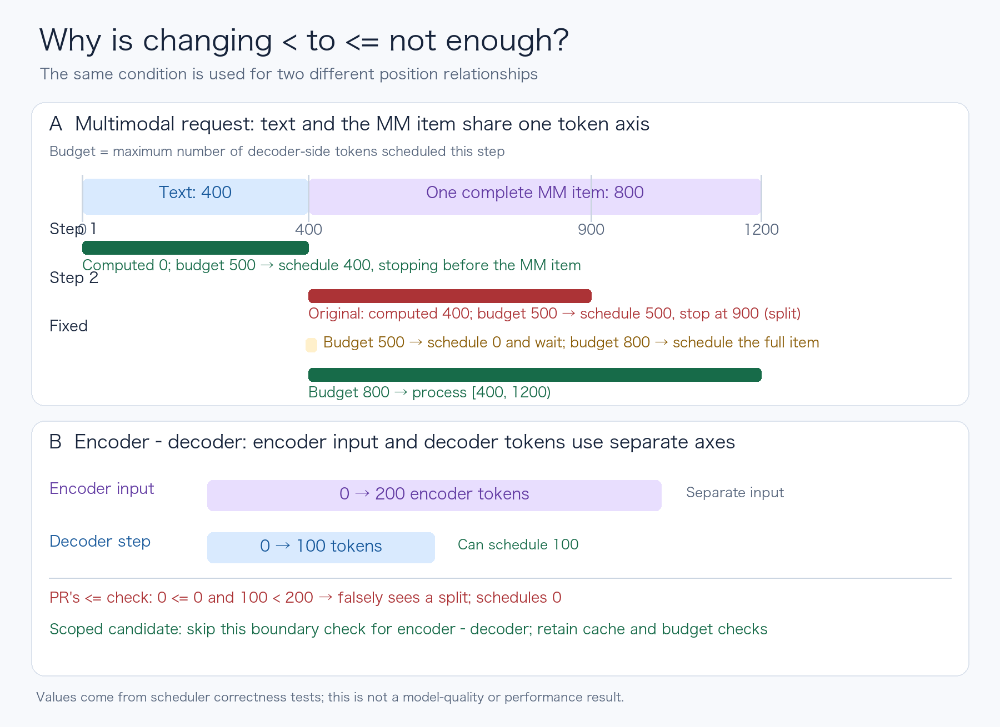

# vLLM scheduler boundary study

A reproducible case study of a scheduler boundary bug in vLLM. This project compares the upstream `main` behavior, the existing fix proposed in [issue #52306](https://github.com/vllm-project/vllm/issues/52306) / [PR #52412](https://github.com/vllm-project/vllm/pull/52412), and a local candidate that limits the boundary guard to the appropriate scheduling path.

This is an independent learning and validation project, **not** a competing upstream pull request. The issue was reported by `chrisc36`; PR #52412 and its original `<=` fix belong to `Chessing234`. The one-line scoped candidate in [`patches/guarded-fix.patch`](patches/guarded-fix.patch) is experimental and has not been merged upstream.

## The question



The diagram can be regenerated with `python3 scripts/draw_boundary.py` (requires Pillow on macOS).

With `disable_chunked_mm_input=True`, a multimodal item occupying token positions `[400, 1200)` must remain intact. If 400 tokens are already computed and a scheduler step has room for only 500 more, scheduling 500 would stop at position 900, inside the item. The desired count for that step is zero.

Current `main` misses this case because its guard checks `num_computed_tokens < start_pos`; `400 < 400` is false. PR #52412 changes the comparison to `<=`, which fixes this case. However, encoder-decoder requests use the same function with encoder input anchored at position zero. The decoder's token count and the separate encoder input length are not positions in one shared token stream; the new guard can therefore suppress a valid decoder prefill. A scoped candidate excludes encoder-decoder requests from this particular boundary comparison while leaving their other scheduling checks in place. See [the detailed analysis](docs/analysis.md).

## Observed results

The saved run compares `main` commit `3853733` with PR commit `14b798c` using Python 3.12.14. Four direct behavioral checks and two existing upstream cross-attention tests were run. The direct checks use a minimal request and cache double to isolate the real `Scheduler._try_schedule_encoder_inputs` method; the upstream tests exercise more of the scheduler. They do not run model inference.

| Code under test | Direct behavioral checks | Two upstream cross-attention tests |
| --- | --- | --- |
| `main` (`<`) | 1 fails: item split at the boundary; 3 pass | Not run in this comparison |
| PR #52412 (`<=`) | 1 fails: encoder-decoder request blocked; 3 pass | 2 fail: no request scheduled |
| Scoped local candidate | 4 pass | 2 pass |

See the [generated summary](results/latest/summary.md) and its adjacent `.log` files for exact commands and raw output. This is a **correctness comparison**, not a throughput, latency, GPU, or model-quality benchmark. The PR's added LLaVA pytest could not be used with the shared environment because its older source imports `PixtralRotaryEmbedding`, which is unavailable in the installed `transformers 5.17.0`; the direct boundary checks avoid model loading.

## Reproduce

Requirements: two vLLM source checkouts (a current `main` checkout and a worktree at PR #52412), Python 3.12, `pytest`, and vLLM installed in the environment. Follow vLLM's [development setup](https://github.com/vllm-project/vllm/blob/main/AGENTS.md). The same Python environment can run against both source trees, but version mismatches may affect other tests.

If the checkouts and this project are sibling directories, prepare the PR worktree with:

```bash
git -C ../vllm fetch origin pull/52412/head
git -C ../vllm worktree add --detach ../vllm-pr-52412 FETCH_HEAD
```

From this project directory, run the direct checks:

```bash
../vllm/.venv/bin/python scripts/compare.py --main ../vllm --pr ../vllm-pr-52412
```

Add `--official-tests` to run the two upstream cross-attention tests. Those tests may need network access to look up a Hugging Face model configuration:

```bash
../vllm/.venv/bin/python scripts/compare.py --main ../vllm --pr ../vllm-pr-52412 --official-tests
```

The script accepts paths through CLI arguments; no account name or machine-specific path is embedded in the code. It reads the PR commit's original scheduler file, tests that file and the scoped candidate in sequence, and restores the PR worktree's original file bytes in a `finally` block. It refuses to run if the PR scheduler contains unrelated edits or if the upstream guard changed. `results/latest/` is overwritten on a rerun; use `--output PATH` to keep a separate run.

## Scope and attribution

The local candidate is one possible way to avoid the observed regression, not proof that every scheduler configuration is correct. In particular, this project does not include a compatible full LLaVA integration run, GPU inference, a model-quality evaluation, or a performance benchmark. The results should not be presented as an upstream fix or merged contribution.

This initial repository scaffold, scripts, analysis, and verification were prepared with AI assistance. The repository owner should review and be able to explain each claim and code change before publishing or using this project as a portfolio example. The upstream [issue](https://github.com/vllm-project/vllm/issues/52306) and [PR](https://github.com/vllm-project/vllm/pull/52412) remain the primary sources for the bug report and original proposed fix.
